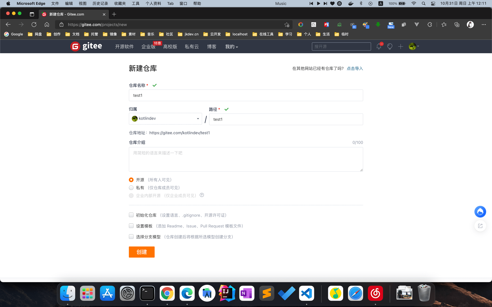
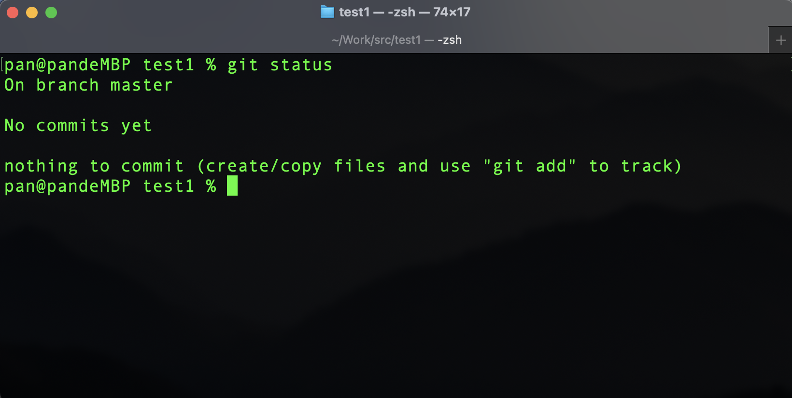
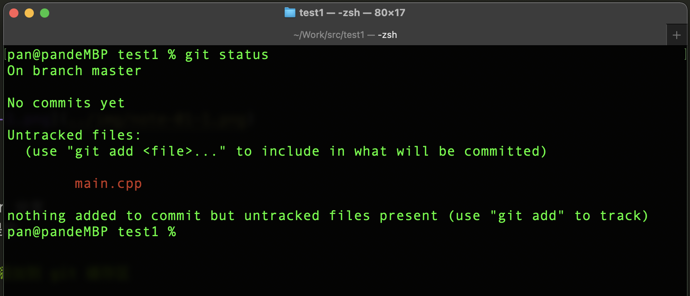
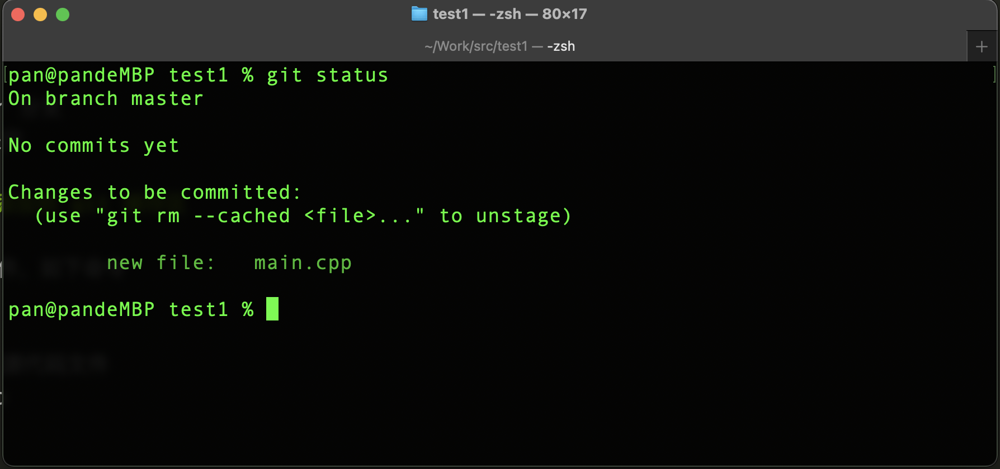
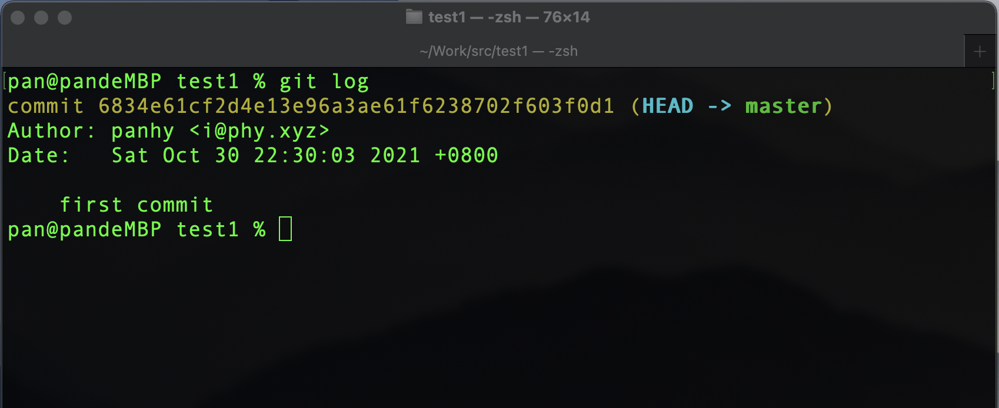
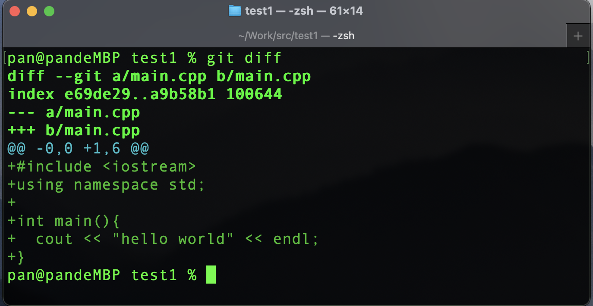

# 通俗易懂地学习Git中最常用的指令

## 一、概述

> 在上节，带大家一起简单了解了 git ，并使用 git 成功将代码托管到 github。在本节，我们进一步学习 git ，我们根据实际开发中的需求，来逐个认识 git 中最常见与最基本的指令。

本系列大概会有 3 篇文章，这是第 2 篇，如果你还没看上一篇，推荐先看上一篇：
[记录 git 几条命令，将自己的代码托管到 Github 上](https://www.jianshu.com/p/cd10f4c5dede)

实际上 git 的每个指令都有很多功能，这系列的文章我会介绍最常用的 git 指令，如果你想深入了解某个指令，git 的官方能提供很多帮助，如下指令可以查看官方的文档帮助

```shell
# 查看git的所有指令
git --help
# 查看 add 指令的详细帮助，此方法可以查看其他指令的详情
git add --help
```

**本节关键词**：本地仓库、远端仓库（或者叫远程仓库、服务器仓库）、工作区、缓存区、本地仓库（或者叫 本地版本库）

## 二、本地仓库的初始化

> 有两种初始化 git 项目仓库的方法。第一种是从一个 git 服务器克隆一个现有的 git 仓库。第二种是在现有项目 或 空项目目录下初始化 git 仓库，并绑定上远端仓库。

### 1. 创建远端仓库

初始化本地仓库前，我们先创建远端仓库。远端仓库我们可以使用 **github**，这是最知名的基于 git 的代码免费托管服务，缺点是国内访问可能比较慢。也可以用 **gitee**，这是国内的基于 git 的代码免费托管服务，特点是访问速度快、中文界面。我们以 **gitee**为例，gitee 的网址是 [https://gitee.com](https://gitee.com)，先创建个人账号，登录之后点击网址右上角的 “创建仓库”，即进入创建仓库界面，如下图



注意：

- 仓库名可以用中文，但是仓库路径必须要用英文标识
- 如果希望自己的仓库可以被别人访问，则选择 “开源”

其他选项默认即可，点击“创建”按钮即可完成 远端仓库的创建。

### 2. 从远端克隆仓库

> 我们在 gitee 上有一个现有的仓库 `https://gitee.com/kotlindev/test1.git`。

将远程 test1 仓库克隆到本地，克隆完成后本地将自动创建出 test1 目录，同时远端的文件同步到本地。

```shell
# 将远端 test1 仓库克隆到本地
git clone https://gitee.com/kotlindev/test1.git
```

克隆的同时可以也重命名，如下命令

```shell
# 将远端 test1 仓库克隆到本地，同时命名为 demo
git clone https://gitee.com/kotlindev/test1.git demo1
```

### 3. 在本地初始化 git 仓库

如果我们不克隆远端的仓库到本地，下面还有两种方法可以将本地的仓库绑定到远端的仓库。

方法一：将本地代码目录初始化为 git 项目，后绑定远端仓库

```shell
# 创建项目目录
mkdir test1
# 进入项目目录
cd test1
# 初始化git仓库
git init
# 绑定绑定远端仓库
git remote add origin https://gitee.com/kotlindev/test1.git
```

方法二：将远端仓库的`.git`目录拷贝（或移动）到本地项目目录

```shell
# 进入项目目录
cd test1
# 拉取远端仓库，并命名为 temp ，代表的是临时目录
git clone https://gitee.com/kotlindev/test1.git temp
# 将 temp 目录中的 .git 目录移动到当前项目目录
mv temp/.git ./
# 删除掉临时目录
rm -r temp
```

上面两种方法，都可以将本地项目目录与远端的 git 仓库进行绑定，绑定之后方可进行代码的同步、推送。

## 三、git 仓库的基本操作

### 1. 查看仓库的状态

```shell
git status
```

可以看到如下提示



上面的截图内容是：

- 当前在 master 分支
- 目前没有任何提交

### 2. 将工作区文件添加到 git 缓存区

我们先创建一个文件，如下命令

```
# 添加一个 c++ 源代码文件
touch main.cpp
```

现在文件在工作区，使用 `git status` 命令查看 git 状态，可以看到一个关键词 `Untracked files`，也就是没有被 git 监控的文件，这里所说的监控就是跟踪文件的变化，如下图



添加到 git 缓存区后，项目里的文件将会被 git 监控，使用以下命令将 `main.cpp` 文件添加到 git 缓存区

```shell
git add main.cpp
```

此时再使用 `git status`可以看到如下图


可以看到 `Changes to be committed`关键词，代表已经在 git 缓存区的文件。

在实际开发中，当我们每次编码完成后，工作区可能创建了很多文件，我们可以使用以下命令将所有文件添加到 git 缓存区。

```shell
# .代表当前目录，以下命令是将工作区的所有文件添加 git 缓存区
git add .
```

### 3. 将缓存区文件提交到 版本库

使用以下命令将缓存区的文件提交到版本库

```
# -m 参数后面代表的信息备注
git commit -m "first commit"
```

此时我们看到终端的一些提示信息，包含文件变动的一些基本信息，如下图


每次提交的变更内容，都会被 git 记录下来，我们可以使用以下命令查看 git 提交记录

```shell
git log
```

此时我们可以看到 git 如下图信息


**第一行**：本次提交的基本信息。第 2 列表示 git 提交的唯一标识（我们可以叫做提交 id 或者 commit id）；第 3 列表示当前分支提交到远端 `master` 分支，表示本地当前分支（默认是 master） 提交到远端 `master`分支

> 我们现在还没提到分支概念，你只需要知道有这个名词就可以了，后面章节中将说明。任何时候，HEAD 所指向的分支就是当前分支。在无任何新建分支情况下，也就是只有 master 分支，HEAD 所指向的分支就是当前分支 -- master。在新建分支并切换到新分支后，HEAD 所指向的分支就是新分支。

**第二行**：作者信息。第 2 列是我们设置的本地作者名称；第 3 列是我们设置的作者邮箱

**第三行**：git 提交的时间

**剩余信息**：作者提交时的备注信息

### 4. 查看文件差异

在 git 仓库中的文件，都会被 git 跟踪，如文件修改历史、是否是新文件、提交提交历史等等。

`git diff` 命令用于查看的文件的差异，我们可以通过该指令对比文件的各种差异，以下是一些常用指令

```
# 比较所有文件与缓存区文件差异
git diff
# 比较当前文件和缓存区文件差异
git diff <file>
# 比较两次提交之间的差异
git diff <id1> <id2>
# 在两个分支之间比较
git diff <branch1> <branch2>
# 比较缓存区和版本库差异，与下一条指令的效果一样
git diff --staged
# 比较缓存区和版本库差异，与上一条指令的效果一样
git diff --cached
# 仅仅比较统计信息
git diff --stat
```

但要注意的是，只有使用 `git add` 指令将文件文件到缓存区之后，文件的信息才会被记录，接下来我们做个简单演示，修改`main.cpp`，添加以下代码

```cpp
#include <iostream>
using namespace std;

int main(){
  cout << "hello world" << endl;
}
```

通过`git diff`命令查看工作区与缓存区的文件差异，如下图



有两个关键词 `a` 和 `b`，分别指的是缓存区和工作区，可以看出在`b`中的`main.cpp`文件多了 6 行代码

### 5. 将本地仓库提交同步到远程仓库

我们使用以下命令将本地代码推送到远端仓库

```
# 将当前分支 (默认是master) 推送到远端仓库的 master 分支
git push -u origin master
```

实际上提交成功之后，远端的 `main.cpp` 文件是空的，是因为本地版本库还是一个空的 `main.cpp`文件。虽然`main.cpp` 文件被修改了，但还未提交到本地的版本库。所以还需要进行下面的操作

```shell
# 将所有变更添加的缓存区
git add .
# 将缓存区的变更提交到 本地git版本库
git commit -m "修改main.cpp文件"
# 将本地版本库提交到远端仓库
git push -u origin master
```

此时，我们再浏览远端仓库，可以看到代码已经同步过去了。

## 四、总结

在这篇文章中，我们介绍了 git 最常用的指令，并完成了一些最基本的操作。在下一篇文章中，我们将进一步介绍 git 实用的技巧，帮助我们提高工作效率，欢迎持续关注！
