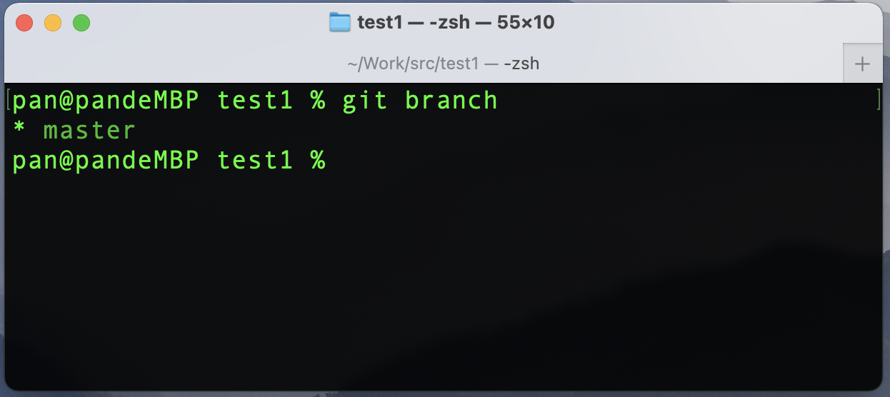

# 怎样使用 git 进行项目的协同开发

## 一、概述

> 这篇文章是本系列的第 3 篇。通过前两篇，我们已经掌握了 git 的最常用的命令以及相关操作。在本篇文章，我们将学习企业开发中最常用的协同方式，那就是基于 git 分支进行协同开发。如果你还没有阅读过前两篇文章，建议先阅读。

- 1. [git 基本操作方法，记录几条命令将自己的代码托管到 Github](../README.md)
- 1. [通俗易懂地学习 git 中最常用的命令](./note-02.md)

## 二、git 分支

### 1. 分支简介

git 通过保存一系列不同时刻的快照，来记录文件的变化和不同时刻的差异。Git 的分支，本质上是指向提交对象的可变指针。 Git 的默认分支名字是 master。 在多次提交操作之后，你其实已经有一个指向最后那个提交对象的 master 分支。 master 分支会在每次提交时自动向前移动。

Git 的 master 分支并不是一个特殊分支。 它就跟其它分支完全没有区别。 之所以几乎每一个仓库都有 master 分支，是因为 git init 命令默认创建它，并且大多数人都懒得去改动它。

实际上，不同的开发团队的分支管理规范不一样，但大体上是相同的。

下面是一个典型的 git 分支的工作流


**Master**：这里指 master 主分支，master 分支记录的重大版本更新
**Develop**：这里指 develop 开发分支，从 master 分支创建，变动比较大，通常待上线的功能合并到这个分支
**Feature**：这里指 feature 功能分支，从 develop 分支创建，在这种分支上去开发新的功能。开发功能的时候，这个功能属于哪个目标发行还不知道。功能如果一直在开发，对应的这个功能分支就可以一直存在，发开结束后，待上下的时候要合并到 develop 分支上，如果不想要开发的这个功能了，可以直接扔掉它。

### 2. 分支的基本操作

**查看分支**
我们先通过以下命令查看分支信息

```shell
git branch
```

看到如下信息


**创建与切换分支**
使用以下指令从当前分支创建新分支，并切换到新分支

```shell
# 创建develop分支
git branch develop
# 切换到 develop 分支
git checkout develop
```

或者我们使用以下命令创建之后直接切换到新分支

```shell
# checkout 指令使用 -b参数，创建之后即切换
git checkout -b develop
```

此时我们再使用 `git branch` 查看分支信息，如下图


可以看到现在一共有两个分支，而有“\*”标识的是我们现在所在的分支。

**删除分支**
经过上面的操作，我们现在已经在 `develop` 分支上，下面我们创建一个新分支，并进行删除

```shell
# 创建并切换到 feature/211031
git checkout -b feature/211031
```

上面的指令我们创建了一个功能分支，假如功能开发到一半，不想要了，我们就可以删除掉，使用以下指令

```shell
# 先切换回develop分支
git checkout develop
# 删除 feature/211031 功能分支
git branch -d feature/211031
```

删除远端分支，为了演示删除远端分支，我们先将本地的`develop`分支提交到远端

```shell
# 将本地develop 分支提交到远端
git push -u origin develop
```

如果远端没有 develop 分支将会自动创建，这里还有个参数是 `-u`，是`--set-upstream`的简写，意思是关联远端的分支。`--set-upstream`参数用于推送代码是进行分支关联，该参数与 `push`指令联用。而还有另一个类似参数`--set-upstream-to`用于直接设置关联，该参数与`branch`指令联用。如下指令

```shell
# 将远端 master 关联到 本地 develop分支
git branch --set-upstream-to origin/master develop
```

以上指令将远端 `master` 分支关联到本地的 `develop` 分支，准确的说，如果我们说将本地 `develop` 分支追踪远端的 master 分支更合理。以上的设置只是个实例，在实际中，根据分支名称，本地分支应当与远端分支一一对应。

将代码推送到远端之后，我们可执行远端分支删除操作，如下指令

```shell
# 删除远端的 develop 分支
git push -u origin -d develop
```

> origin 关键词指的是一个指针，origin 指向的是本地的代码库托管在远端的仓库，可以说 origin 对应的是远端仓库。

### 3. 同步远端分支代码

**相关指令**
使用下面的命令合并远端代码

```shell
# 从远程获取最新版本到本地
git fetch
# 将远端版本合并到当前分支
git merge FETCH_HEAD
```

这里出现一个关键词`FETCH_HEAD`，该关键词同样是一个指针，用于跟踪刚刚从远程存储库中获取的内容。

以上的两个指令可以用一个 `git pull`来代替， 其实就是 `git fetch` 和 `git merge FETCH_HEAD` 的简写。命令格式如下

```shell
git pull <远程主机名> <远程分支名>:<本地分支名>
```

**实例**
取回 origin 主机的 master 分支，与本地的 develop 分支合并，如下指令

```shell
git pull origin master:develop
```

## 三、标签

> 参考：[https://git-scm.com/book/zh/v2](https://git-scm.com/book/zh/v2)
